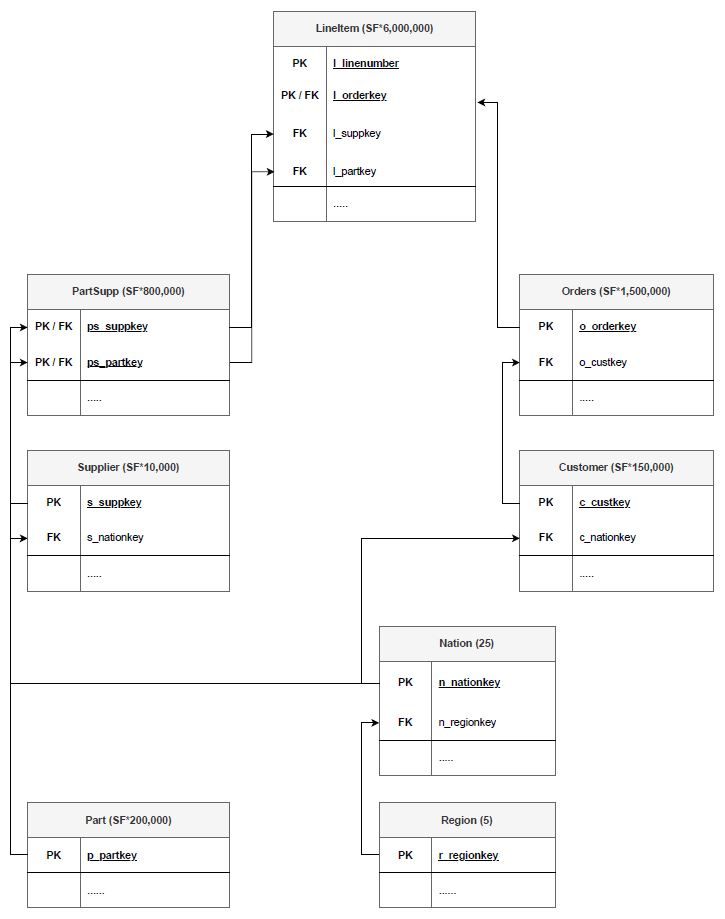
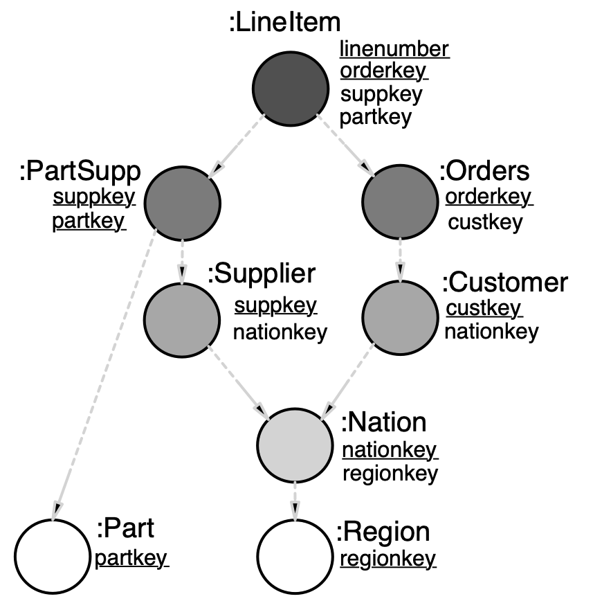
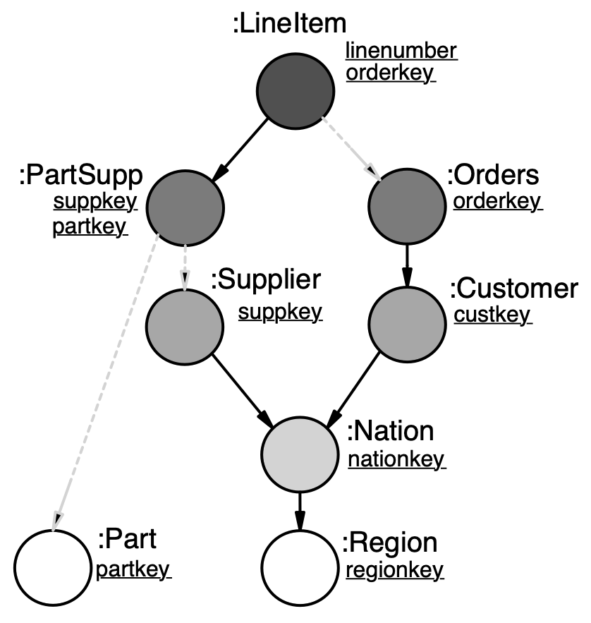
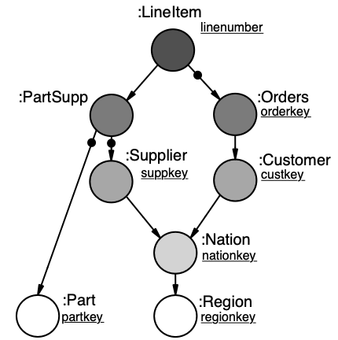

# Datasets and Experiment setup

For the TPC-H dataset we refer to the [TPC website](https://www.tpc.org/tpch/). For convenience we have provided the SQL files for TPC-H with scaling factor 0.01 (TPC-H small) here. For other scaling factors the user would have to generate TPC-H instances and export the tables into csv format.

The image below shows the TPC-H schema:

For instructions on how to import the required files into Neo4j and how to set up the experiments we refer to the [Experiments Manual](https://github.com/graphdbexperiments/er_graph_experiments/tree/main/experiments_manual) provided in this repository.

In our experimental set up we have transformed the TPC-H dataset into a graph database. For this puporse we have modeled the dataset as property graph adhering to different semantics which are presented underneath:

<ins>TPC-H modelled as porperty graph (relational semantics):</ins>

<ins>TPC-H modelled as porperty graph (mixed semantics):</ins>

<ins>TPC-H modelled as porperty graph (graph semantics):</ins>

