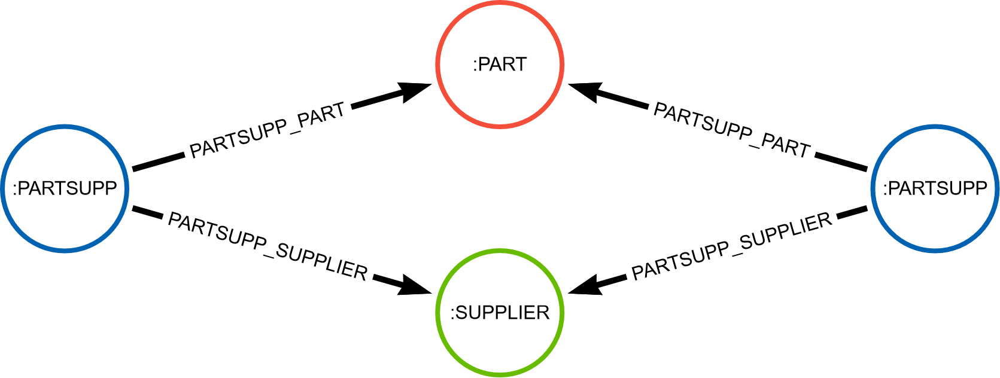
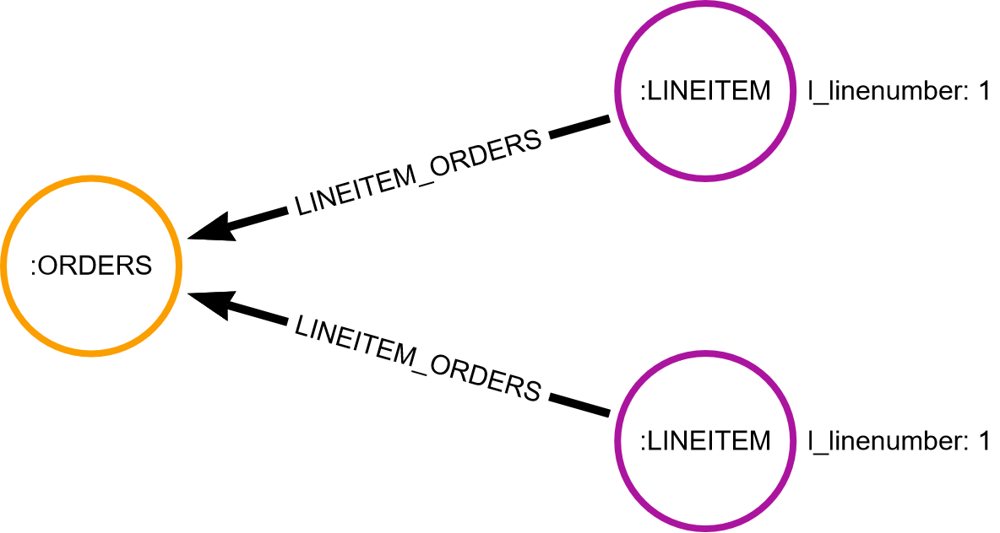

# Experiments concerning entity integrity management in E/R graphs 

This folder contains files for the experimental set up enabling users to recreate the experiments. In addition, we have provided the results of these experiments we conducted in our research.

In particular, we measure the time and database hits required to verify the E/R keys $PARTSUPP(\\{PART, SUPPLIER\\}, \emptyset)$ and $LINEITEM(\\{ORDERS\\},\\{linenumber\\})$ on TPC-H. For the dataset modeled adhering to graph semantics this means that the following frobidden patterns should not be present in the graph, i.e. the corresponding queries should not return any result.

<ins>Forbidden pattern for the E/R key   $\underline{PARTSUPP(\\{PART, SUPPLIER\\}, \emptyset)}$:</ins>

<ins>Forbidden pattern for the E/R key   $\underline{LINEITEM(\\{ORDERS\\},\\{linenumber\\})}$:</ins>

