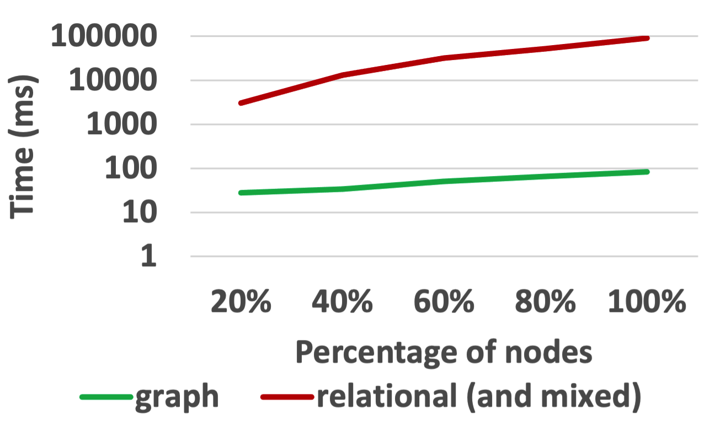

This folder contains the Python file to recreate the experiments for the verification of the E/R key $LINEITEM(\\{ORDERS\\},\\{linenumber\\})$ on TPC-H for different scaling factors and under different semantics as well as the results.

<ins>Results for TPC-H small (sf=0.01):</ins>

