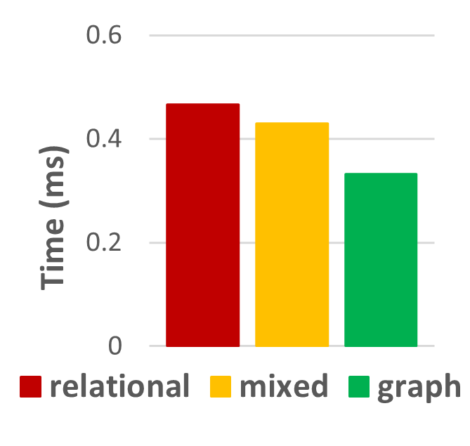
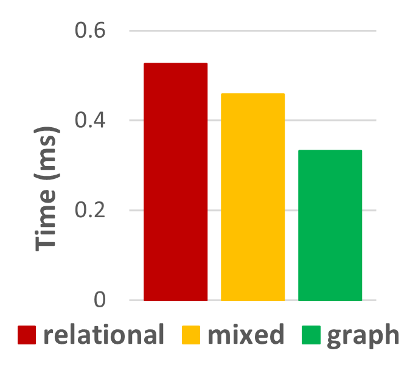
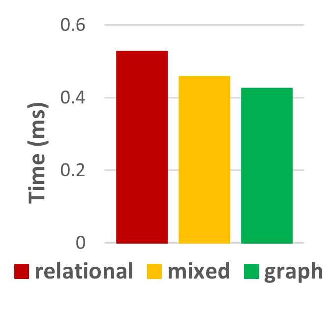

This folder contains the Python file to recreate the experiments for the verification of the E/R key $LINEITEM(\\{ORDERS\\},\\{linenumber\\})$ on TPC-H for different scaling factors and under different semantics as well as the results.

<ins>Results for TPC-H small (sf=0.01):</ins> 

<ins>Results for TPC-H medium (sf=0.1):</ins> 

<ins>Results for TPC-H large (sf=1):</ins> 

