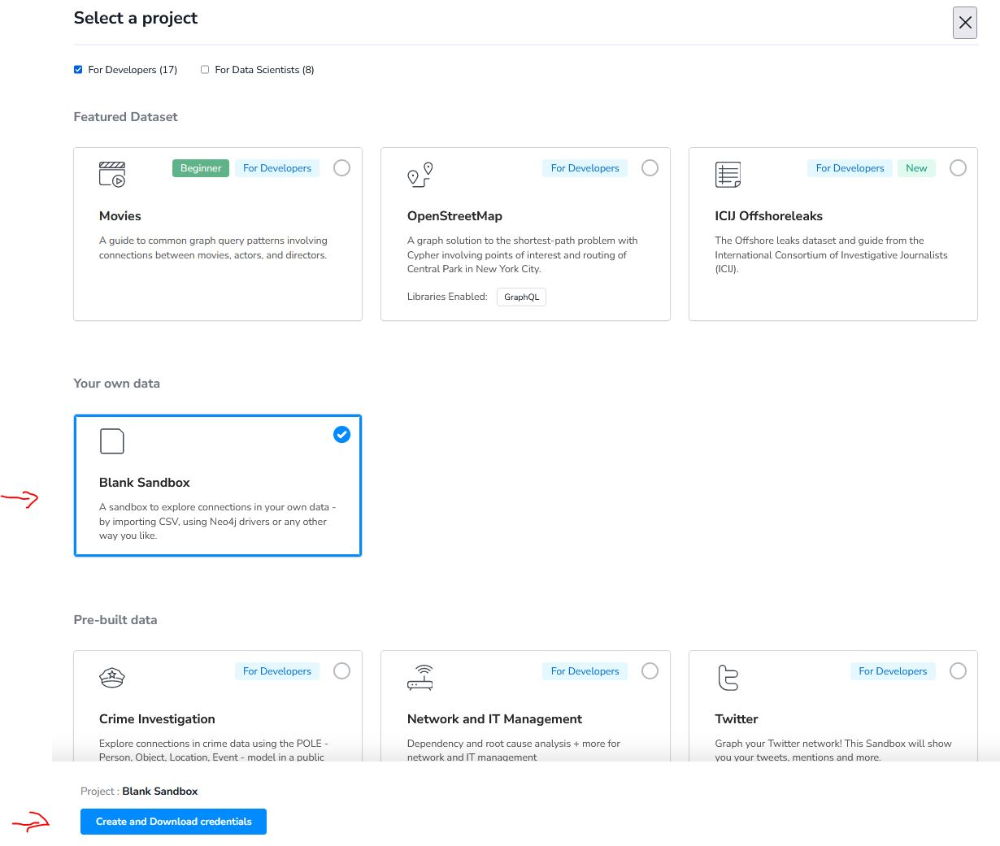
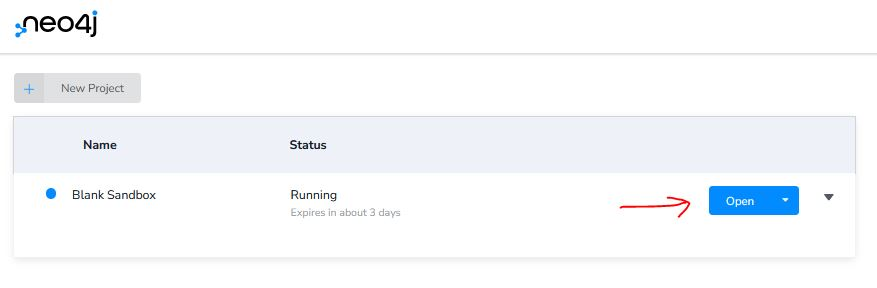
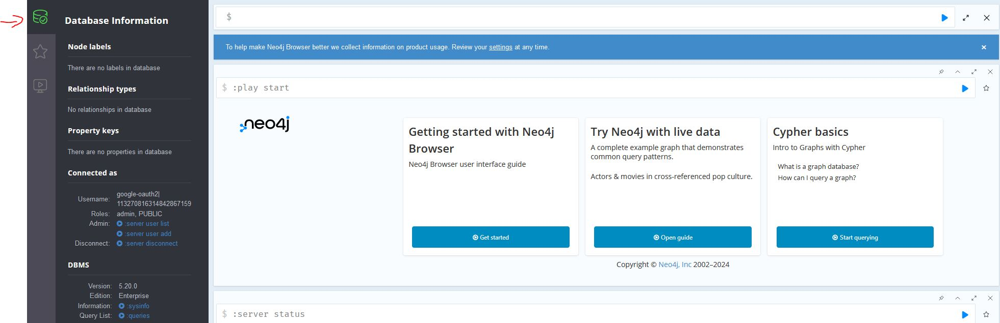
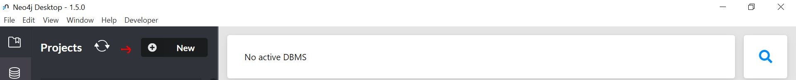
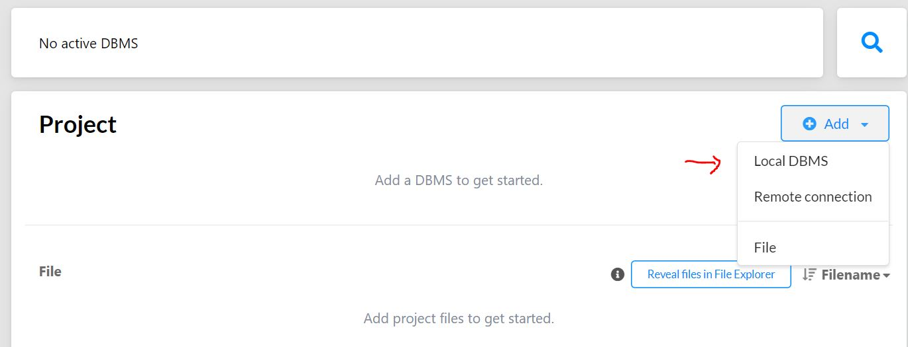
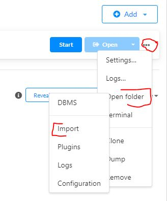
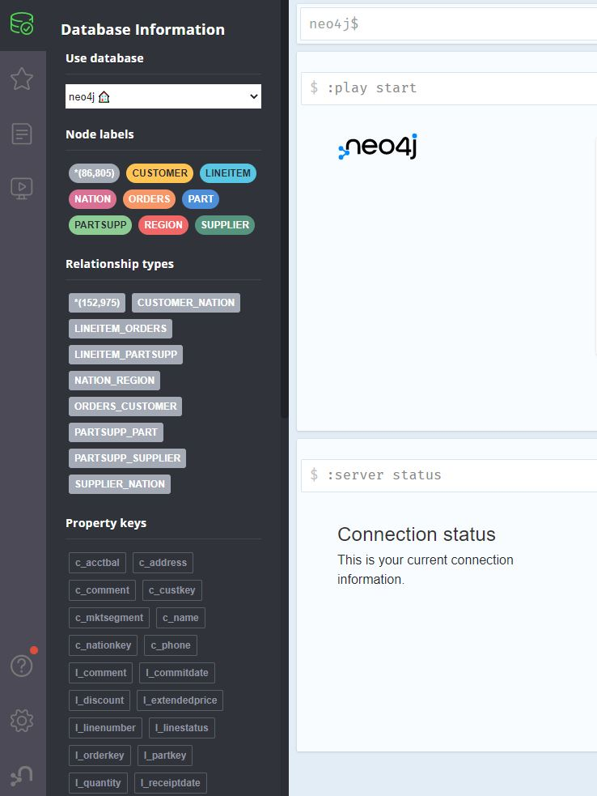

# Manual to replicate experiments for E/R graphs

This manual will provide a step by step guide on how to get set up to replicate the experiments on graph translations of TPC-H discussed in our research.

In particular, this folder contains information on the following:

- instructions on how to set up Neo4j
- information on how to import required files into Neo4j Desktop / Neo4j Sandbox
- details on how to run Python in conjunction with Neo4j


### Neo4j Sandbox:

To replicate the experiments without downlaoding Neo4j Desktop to a local machine we recommend using the [Neo4j Sandbox](https://neo4j.com/sandbox/). By clicking the link and logging in the user will be able to create a project using one of Neo4j's sample datasets. Here, it is best to create an "empty", blank Sandbox.



Once the blank Sandbox is set up it is necessary to open this Graph Database in Neo4j Browser to import the required files. For this we need to click on the button as shown below and select "Open in Neo4j Browser".



Once the connection to the database is established the screen should look as follows.



In case this does not happen and there are problems with establishing a connection a renewed login into the Sandbox might solve the issue.

To import all required csv files correctly we refer to the csv files provided under [Datasets](https://github.com/graphdbexperiments/er_graph_experiments/tree/main/datasets) and the incstructions on [How to Import CSV data into Neo4j](https://neo4j.com/docs/getting-started/data-import/csv-import/).


### Neo4j Desktop:

To gain full usability and replicate all experiments we recommend to download Neo4j Desktop. This can be obtained in Neo4j's official [Download Center](https://neo4j.com/download-center/#desktop). Detailed installation instructions can be found in [Neo4j Desktop's manual](https://neo4j.com/docs/desktop-manual/current/installation/). The manual also provides on overview of Neo4j Desktop's feautures in the [Visual Tour](https://neo4j.com/docs/desktop-manual/current/visual-tour/).

Once installed the user will have to open Neo4j Desktop and create a new project



and within this project the user has to create a new local database.



Once the local database is created the user has to import the csv files from the TPC-H dataset into the "Import" folder associated with the local database which can be opened here:



After all csv files are in the correct folder they can be loaded into our Neo4j instance to create nodes using the following Cypher statement:

```
LOAD CSV WITH HEADERS FROM 'file:///region_small.csv' AS line
CREATE (r:REGION{r_regionkey: toInteger(line.R_REGIONKEY)})
SET r.r_name = line.R_NAME,
    r.r_comment = line.R_COMMENT
RETURN r LIMIT 10
```

For further information on the respective Cypher statements we refer to the files in this folder.


## Finishing up creating graph translation of TPC-H:

Whether using Neo4j Sandbox or Neo4j Desktop once all csv files have been loaded and respective nodes have been created the following steps need to be executed:

1.) Create constraints (primary keys) as outlined in the file in this folder

2.) Create edges as outlined in the file in this folder (we note that only the edges according the corresponding semantics need to be introduced)

3.) Remove properties from nodes in accordance with semantics that is chosen (i.e. remove foreign key attributes if not required). Here we like to add that this might require dropping of certain constraints first if introduced to speed up edge creation.


For any issues executing these steps we refer again to the [Neo4j Cypher Manual](https://neo4j.com/docs/cypher-manual/current/introduction/) and to troubleshoot any issues we refer to to the [Neo4j Community Forum](https://community.neo4j.com/) as well. 

Once all is set up the database should look as follows.





## How to run Python and Neo4j using Neo4j Python Driver: 

For the experiments on the TPC-H datasets we used Neo4j Desktop and Python and connected to a Neo4j database using the Neo4j Python Driver. For installation instructions and some sample code fragments we refer the user to the [Neo4j Python Driver Manual](https://neo4j.com/docs/api/python-driver/current/). For the Python files used to conduct the experiments we refer the reader to the corresponding folders in this repository.


## First experiments using Neo4j:

Once all required csv files are imported and the graph translation of TPC-H is completed we are able to run the first experiments. Here we outline the Cypher statements used for the [Verification of E/R keys](https://github.com/graphdbexperiments/er_graph_experiments/tree/main/entity_integrity) for TPC-H modelled adhering to graph semantics.

The following query illustrates the validity of the E/R key on PARTSUPP nodes:

```
MATCH pattern1 = (s:SUPPLIER)<-[]-(ps1:PARTSUPP)-[]->(p:PART), pattern2 = (s:SUPPLIER)<-[]-(ps2:PARTSUPP)-[]->(p:PART)
WHERE id(ps1) < id(ps2)
RETURN pattern1, pattern2
```

If the key holds then this query will return no output. Similarly, we can verify the E/R key on nodes labelled LINEITEM:

```
MATCH pattern = (l1:LINEITEM)-[]->(o:ORDERS)<-[]-(l2:LINEITEM)
WHERE id(l1) < id(l2) AND l1.l_linenumber = l2.l_linenumber
RETURN pattern
```

For details around the experiments conducted in our research we refer to the respective folders that contain information on the experiments around [Entity Integrity](https://github.com/graphdbexperiments/er_graph_experiments/tree/main/entity_integrity) and [Referential Integrity](https://github.com/graphdbexperiments/er_graph_experiments/tree/main/referential_integrity) management in E/R graphs.


### Entity Integrity Experiments

The scripts to execute the experiments concering entity integrity are located in a [separate folder](https://github.com/graphdbexperiments/er_graph_experiments/tree/main/entity_integrity/scripts).

### Referential Integrity Experiments

To run the experiments related to referential integrity the user needs to navigate to the [respective foler](https://github.com/graphdbexperiments/er_graph_experiments/tree/main/referential_integrity/scripts) and depending on the experiment scenario execute the corresponding python script. Before executing either python script the following is required. In each script the parameters that need adjusting are found in the main method.

First the credentials to establish a connection to Neo4j have to specified under:

```
    local_bolt = <local_bolt>
    local_pw = <password>
    local_user = "neo4j"
```

After that the experiment settings can be found under:

```
    factor = 1 # sclaing factor for TPC-H (small = 0.01 / mdedium = 0.1 / large = 1)
    percentage_to_update = [0.2, 0.4, 0.6, 0.8, 1]
    is_relational_model = True
    is_semirelational_model = False
    is_graph_model = False

    runs = 20

    outliers = 5
```

Here, depending on dataset size the variable *factor* will have to be set to either 0.01, 0.1 or 1. The list *percentage_to_update* represents the amount of records for the respective experiment scenario that are being updated. For each value in the list the experiment will be run multiple times according to the amount specified under *runs*. Exactly one of the three boolean variables *is_relational_model*, *is_semirelational_model* and *is_graph_model* will have to be set to True and the other two to False to specify which graph semantics we use for the experiment. Finally, the variable *outliers* determines the amount of measured results on the top and bottom end of results that are disregarded when determining average values.


  
