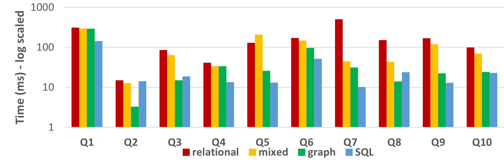
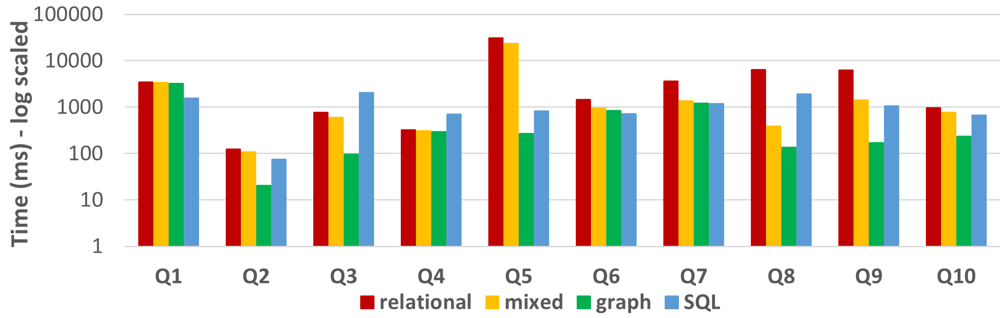
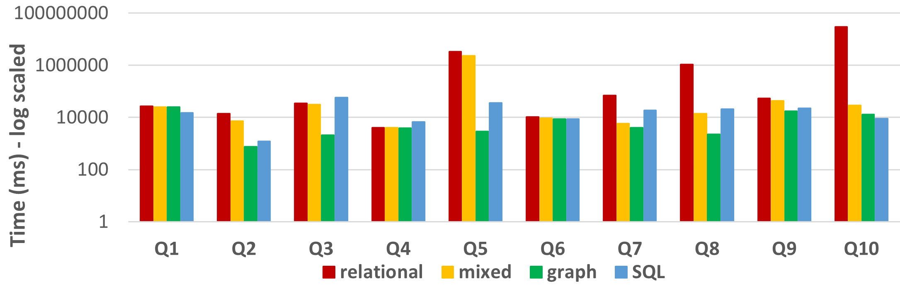

This folder contains the Python file to recreate the experiments for the benchmark queries and refresh operations from TPC-H for different scaling factors for and under different semantics for Neo4j and for MySQL as well as the results.

Underneath are the results shown for different scaling factors for the TPC-H benchmark queries:

<ins>Results for TPC-H small (sf=0.01) shown for time regularly scaled and logarithmically scaled:</ins> 

<ins>Results for TPC-H medium (sf=0.1) shown for time regularly scaled and logarithmic scaled:</ins> 

<ins>Results for TPC-H large (sf=1) shown for time regularly scaled and logarithmic scaled:</ins> 

