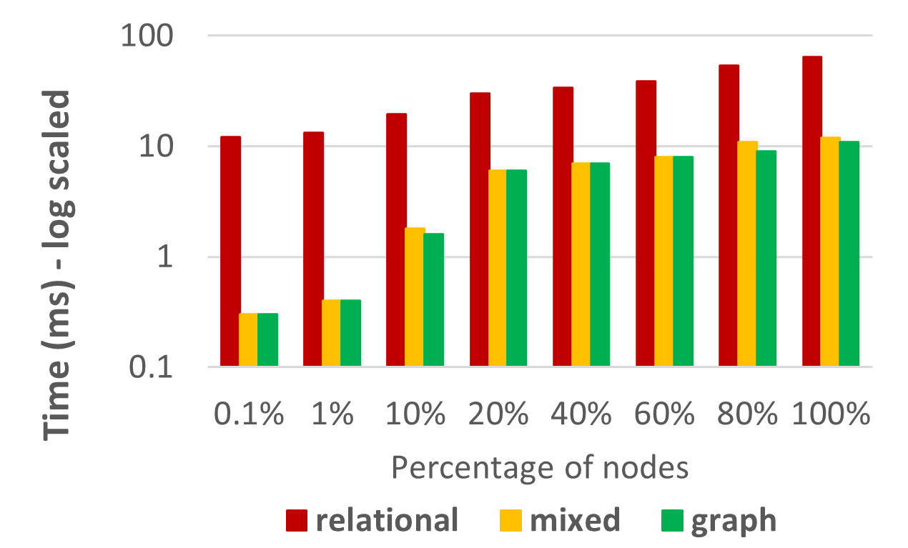
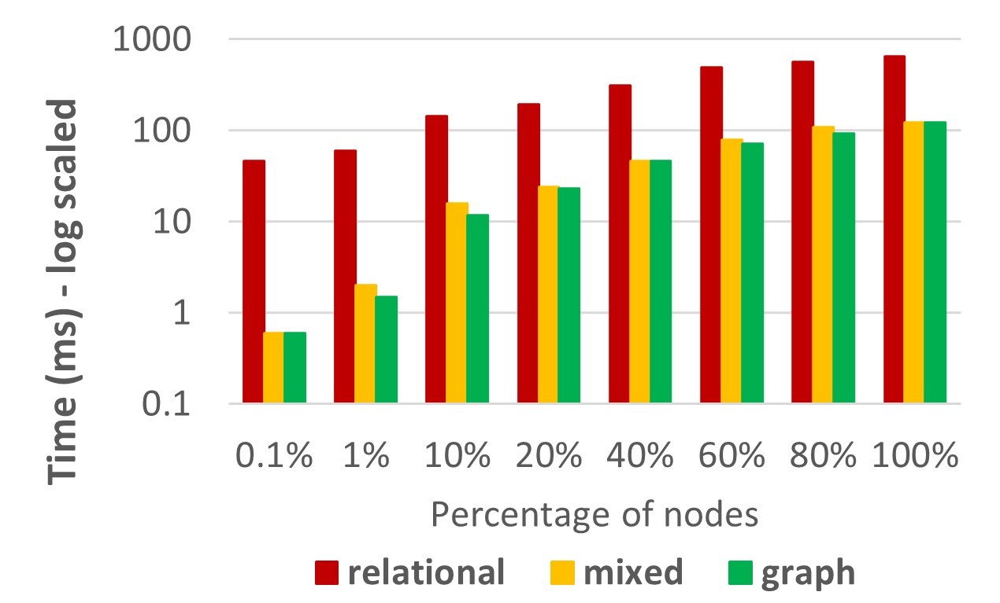
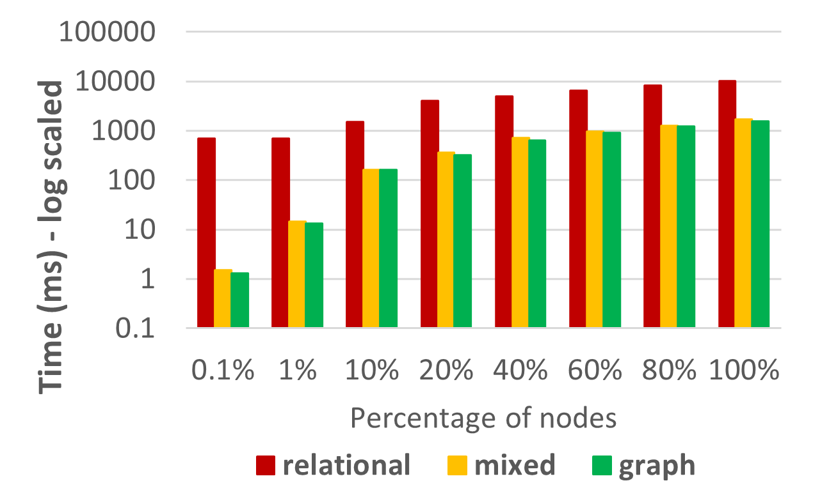

This folder contains the Python file to recreate the experiments for the update propagation chain $CUSTOMER \subset ORDERS$ on TPC-H for different scaling factors and under different semantics as well as the results.

Underneath are the results shown for different scaling factors for TPC-H:

<ins>Results for TPC-H small (sf=0.01) shown for time logarithmically scaled:</ins> 

<ins>Results for TPC-H medium (sf=0.1) shown for time logarithmically scaled:</ins> 

<ins>Results for TPC-H large (sf=1) shown for time logarithmically scaled:</ins> 

